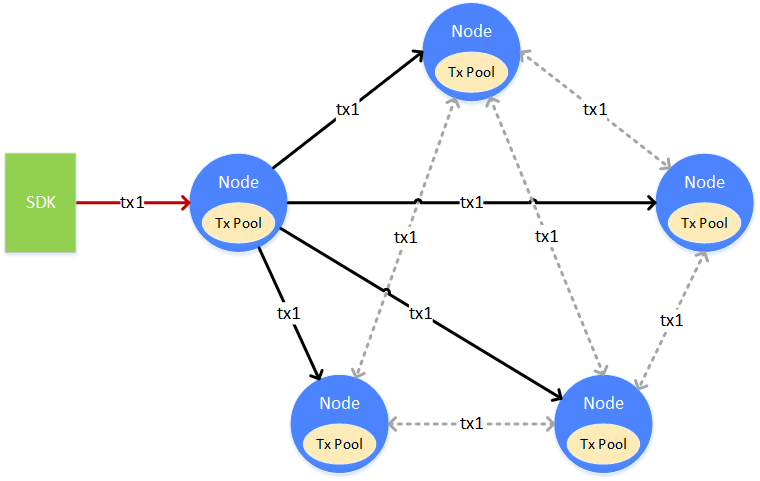

# 交易同步

交易同步，是让区块链的上的交易尽可能的到达所有的节点。为共识中将交易打包成区块提供基础。

一笔交易（tx1），从客户端上发往某个节点，节点在接收到交易后，会将交易放入自身的交易池（Tx Pool）中供共识去打包。与此同时，节点会将交易广播给其它的节点，其它节点收到交易后，也会将交易放到自身的交易池中。交易在发送的过程中，会有丢失的情况，为了能让交易尽可能的到达所有的节点，收到广播过来交易的节点，会根据一定的策略，选择其它的节点，再进行一次广播

** 交易广播策略
**

如果每个节点都没有限制的转发/广播收到的交易，带宽将被占满，出现交易广播雪崩的问题。为了避免交易广播的雪崩，FISCO BCOS根据经验，选择了较为精巧的交易广播策略。在尽可能保证交易可达性的前提下，尽量的减少重复的交易广播。

* 对于SDK来的交易，广播给所有的节点

* 对于其它节点广播来的交易，随机选择25%的节点再次广播

* 一条交易在一个节点上，只广播一次，当收到了重复的交易，不会进行二次广播

通过上述的策略，能够尽量的让交易到达所有的节点，但也会在极小的概率下出现某交易无法到达某节点的情况。此情况是允许的。交易尽可能到达更多的节点，是为了让此交易尽快的被打包、共识、确认，尽量的让交易能够更快的得到执行的结果。当交易未到达某个节点时，只会使得交易的执行时间变长，不会影响交易的正确性。

