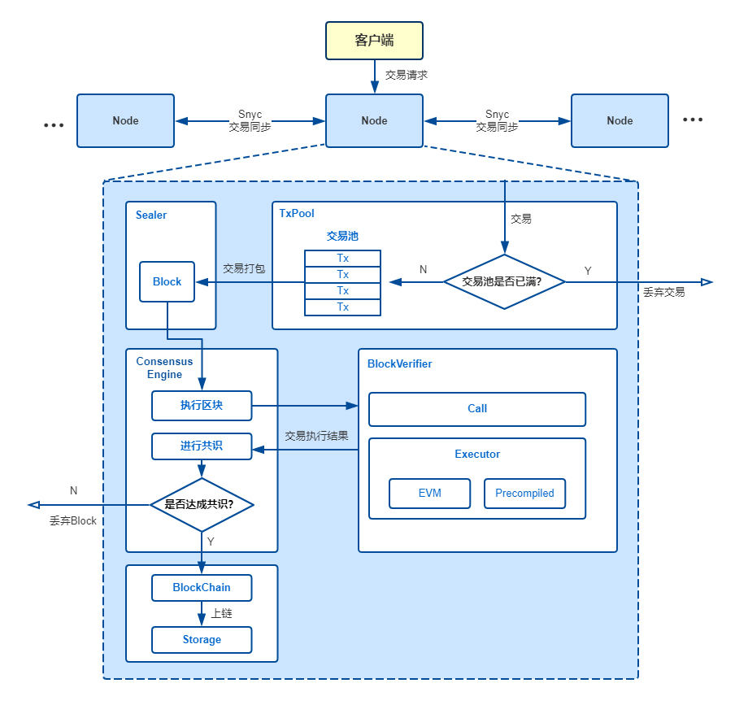

# 交易执行
https://fisco-bcos-documentation.readthedocs.io/zh_CN/latest/docs/design/architecture/transaction_stream.html

Node：区块节点

TxPool：交易池，节点自身维护的、用于暂存收到的交易的内存区域

Sealer：打包器

Consensus Engine：共识引擎

BlockVerifier：区块验证器，用于验证一个区块的正确性

Executor：执行引擎，执行单个交易

BlockChain：区块链管理模块，是唯一有写权限的模块，提交区块接口需要同时传入区块数据和执行上下文数据，区块链管理将两种数据整合成一个事务提交到底层存储

Storage：底层存储

主要关系如下：

用户通过操作SDK或直接编写curl命令向所连接的节点发起交易。
节点收到交易后，若当前交易池未满则将交易附加至TxPool中并向自己所连的节点广播该交易；否则丢弃交易并输出告警。
Sealer会不断从交易池中取出交易，并立即将收集到的交易打包为区块并发送至共识引擎。
共识引擎调用BlockVerifier对区块进行验证并在网络中进行共识，BlockVerifier调用Executor执行区块中的每笔交易。当区块验证无误且网络中节点达成一致后，共识引擎将区块发送至BlockChain。
BlockChain收到区块，对区块信息（如块高等）进行检查，并将区块数据与表数据写入底层存储中，完成区块上链

