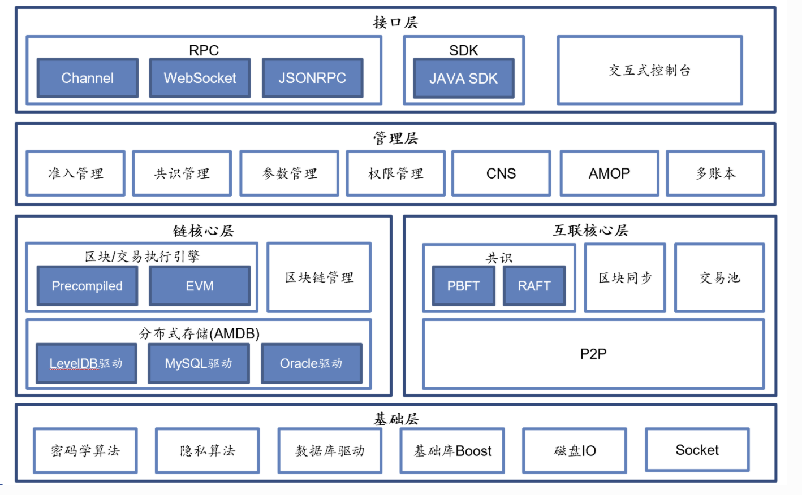

# 模块介绍

```
├── cmake
│   ├── scripts
│   ├── secp256k1
│   └── templates
├── docs
│   └── images
├── evmc
├── fisco-bcos
│   ├── benchmark
│   ├── blockverifier
│   ├── consensus
│   ├── evm
│   ├── main
│   ├── p2p
│   ├── para
│   ├── rpc
│   ├── sync
│   └── tools
├── libblockchain
     BlockChainImp，检查构建创世块、获取区块和交易等face接口的实现
├── libblockverifier
    executeBlock
    executeTransaction
    parallelExecuteBlock
├── libchannelserver
    基于channel的sdk长连接协议定义，与web3sdk中定义类似，此处为server, sdk为client
├── libconfig
    全局配置
├── libconsensus
│   ├── pbft
│   ├── raft
│   └── rotating_pbft
        共识模块
├── libdevcore
        地址, base64, log, rlp, trie等定义
├── libdevcrypto
│   ├── sm2
│   ├── sm3
│   └── sm4
    加密模块
├── libethcore
        block区块定义;
        transaction定义;
        abi定义;
        并行交易定义;
├── libeventfilter
        EventLogFilterManager
        EventLogFilterParams
        EventLogFilter: matches
├── libevm
        EVMC 提供exec接口
        ExtVmFace 提供evm的call get接口
        VMFactory
├── libexecutive
        Executive: call, create,execute
        ExtVM: 生成调用结果或部署结果
├── libflowlimit
├── libinitializer
    总的初始化，将P2P, RPC, Secure, Ledger, Log等模块的初始化集中处理
├── libinterpreter
        VM 虚拟机汇编操作的定义
        VMCall call操作对应汇编的定义
        VMOpt copyCode, exp256 操作工具类
├── libledger
        DBInitializer: 初始化storage相关，create实例
        创建共识引擎
        初始化blockVerifier, eventLogFilter,initBlockChain, initSync, initTxPool, initSync
├── libmptstate
        Account 账户的定义，nonce, code, balance等, setCode账户代码
        State, MPTState MPTStateFactory
        MPTStateFactory: getState
        State: addAddress, addBalance/subBalance, createAccount, codeHash, addresHash
        MPTState: commit操作，维持MPT State状态树，State为数据层的话，MPTState为接口层
├── libnetwork
        ASIOInterface boost的网络模块，用于socket连接, ssl的websocket连接
        Host: 节点间握手(Server/Client) 与P2P关联                 handshakeServer ssl
        asyncConnect..
        Session session会话，监听信息
PeerWhitelist 白名单
├── libp2p
        p2p模块
├── libprecompiled
│   ├── extension
│   └── solidity
    预编译合约的实现，包含接口solidity文件。与table直接交互
├── librpc
        SafeHttpServer 接收/回复rpc API的请求
        Rpc 定义rpc的接口
        JsonHelper HttpMessage等解析工具类
├── libsecurity
    EncryptedLevelDB leveldb文件加密
    EncryptedFile: decryptContents解密文件
    KeyCenter: KeyCenterHttpClient keyServer密钥管理中心
├── libstat
├── libstorage
        BasicRocksDB  put commit
        RocksDBStorage put commit
        LevelDBStorage commit, select, put commit
        SQLStorage: 是否与AMDB相关
        ZdbStorage: 在mysql上，创建预编译、系统表等数据表
        CachedStorage: 缓存存储，具体未知
        ScalableStorage: 可扩展存储，与AMDB proxy相关？
        MemoryTable 系统表，如权限控制,crud等
        BinLog: binlog handler(decode, encode, ), binlog storage
        SQLBasicAccess: buildSQL, buildConditions
        SQLConnectionPool: 连接池
        Table: table的基本操作setEntries
├── libstoragestate
        StorageState MPT操作定义对state的操作如，createAccount,createContract,rollback, addBalance
        StorageStateFactory 工厂类
├── libsync
        DownloadingBlockQueue, DownloadingTxsQueue
        GossipBlockStatus 传递区块状态包
        DownloadRequest, RspBlockReq 下载区块请求
        SyncMaster 同步操作定义，send,broadcast
        SyncTransaction 广播交易
        SyncMsgEngine msg监听、收发
        SyncMsgPacket 广播的消息包
        SyncTreeTopology 网络拓扑图 nodeList, nodeInfo
├── libtxpool
        TransactionNonceCheck commonTxCheck
        TxPool insert, clear, pending, verify等对交易池的操作
├── test
│   ├── data
│   ├── tools
│   └── unittests
└── tools
    └── ci

```
整体架构上，FISCO BCOS划分成基础层、核心层、管理层和接口层：

* 基础层:提供区块链的基础数据结构和算法库


* 核心层: 实现了区块链的核心逻辑，核心层分为两大部分：


    链核心层: 实现区块链的链式数据结构、交易执行引擎和存储驱动
    互联核心层: 实现区块链的基础P2P网络通信、共识机制和区块同步机制

* 管理层: 实现区块链的管理功能，包括参数配置、账本管理和AMOP

* 接口层: 面向区块链用户，提供多种协议的RPC接口、SDK和交互式控制台

FISCO BCOS基于多群组架构实现了强扩展性的群组多账本，基于清晰的模块设计，构建了稳定、健壮的区块系统。


